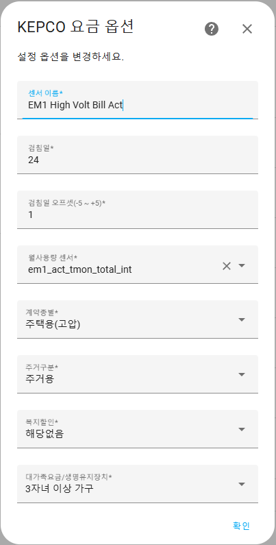

# Kepco Electricity
Home Assistant - 한전 전기요금계산기

Home Assistant에서 한국ON 전기요금계산기의 요금을 센서로 사용하기 위해 만든 Custom Component 입니다.

## 1. 한전 On 계산기 사이트 링크
https://online.kepco.co.kr/PRM033D00

해당 사이트의 모든 종류의 계약을 지원하지는 않으며, 일반적인 주택용 고압/저압만을 지원합니다.

## 2. Home Assistant에 Kepco Electricity 설치

### HACS 또는 Manual 설치

1. HACS를 이용하거나 수동으로 **Kepco Electricity**을 설치합니다.
2. 설치 후 Home Assistant를 재부팅합니다.

### 통합 구성 요소 추가

1. **설정 -> 기기 및 서비스 -> 통합구성요소 추가하기**에서 `KEPCO 전기요금`을 추가합니다.
2. 설정 항목을 입력합니다.
   - **센서 이름**: 원하는 센서 이름을 입력합니다.
   - **검침일**: 25일이면 2025/01/25~2025/02/24 기간으로 계산됩니다.
   - **검침일 오프셋**: ex)실제 검침은 24일에 하지만, 고지서에는 25일(2025/01/25~2025/02/24) 검침으로 계산 되는 경우 검침일은 24일, 오프셋은 1로 설정
   - **월사용 센서**: 월사용량 센서를 추가합니다.(sensor 도메인만 가능하며, 소숫점 자리는 무시하고 정수만 계산됩니다.)
   - **계약 종별**: 주택용 저압 / 주택용 고압
   - **주거 구분**: 주거용 / 비주거용
   - **복지 할인**: 장애인, 국가유공자 등등
   - **대가족/생명유지장치**: 5인 이상, 3자녀 이상 등등

## 3. 센서 업데이트 주기

한전 사이트에 접속해서 전기요금을 계산하고 결과를 받아 오는 방식이라 너무 빈번한 주기의 업데이트는 한전 서버에 무리를 줄 수 있습니다.
HA가 재시작하거나 월사용량의 정수(소숫점 숫자는 무시)가 변경되면 업데이트 되며, 그 외에는 한전 사이트를 호출하지 않습니다.

## Version History
- 2025/02/04 V1.0.1 초기 배포
- 2025/02/05 V1.0.5 API 호출 로직 개선, 속성에 월사용량 추가
- 2025/02/05 V1.0.9 통합구성요소 타이틀을 입력한 센서명으로 나타나게 수정, 속성에 할인항목 다수 추가, 시작시 월사용량 복원 버그 수정(Broken)
- 2025/02/06 V1.1.0 HA 재시작시 기존 상태로 바로 복원, 기존 상태가 이상할 경우 API 호출로 업데이트
- 2025/02/06 V1.2.1 검침일 Offset 설정 추가, 검침일&검침일 오프셋을 속성에 추가
- 2025/02/07 V1.2.2 예상사용량을 속성에 추가
           
